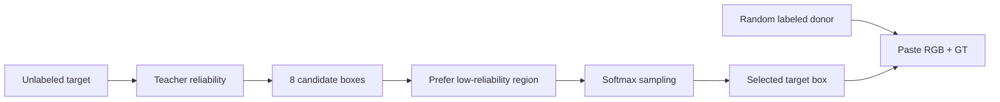
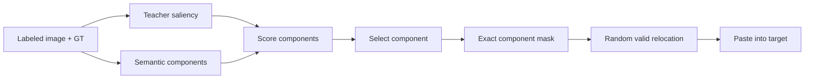

# 2. Thiết lập chung

## 2.1 Dataset

- Dataset: Pascal VOC 2012
- Semi-supervised split: 662 labeled samples
- Validation set: Pascal VOC validation
- Number of classes: 21
- Ignore label: 255

## 2.2 Backbone

- Backbone: ResNet-101
- Decoder: DeepLabV3+
- EMA teacher decay: 0.999

## 2.3 Input & Training Geometry

Thiết lập thực nghiệm sơ bộ hiện tại:

- Crop size: `321 × 321`
- Batch size: `8 / GPU`
- Number of GPUs: `1`
- Global batch size: `8`
- Resize base size: `500`
- Random resize range: `[0.5, 2.0]`

Các kết quả được phân tích trong báo cáo hiện tại đều thuộc thiết lập
**crop 321 × 321**.

Một suite độc lập với crop size `513 × 513` đang được chạy để kiểm tra
liệu các xu hướng quan sát được ở crop 321 có tiếp tục giữ nguyên khi
spatial context tăng lên hay không.

## 2.4 Optimization

- Optimizer: SGD
- Learning rate: `1.25e-4`
- Momentum: `0.9`
- Weight decay: `1e-4`
- Scheduler: polynomial decay
- Epochs: `80`

## 2.5 Semi-supervised training

Các phương pháp cùng kế thừa cơ chế semi-supervised training của AugSeg:

- teacher-student framework;
- pseudo-labeling;
- confidence threshold;
- strong augmentation;
- CutMix;
- adaptive CutMix.

Các khác biệt giữa ba phương pháp:

> **vùng nào nên được lấy để mix, vùng đó được đặt ở đâu, và độ tin cậy của vùng đó nên ảnh hưởng tới training như thế nào.**

---

---

# 3. Mô tả các phương pháp

## 3.1 Baseline — AugSeg + Adaptive CutMix

Baseline giữ nguyên pipeline semi-supervised segmentation của AugSeg:

- teacher-student framework;
- EMA teacher;
- pseudo-labeling trên unlabeled data;
- strong augmentation;
- CutMix và adaptive CutMix.

Teacher tạo pseudo-label cho unlabeled image, sau đó CutMix tạo mixed sample để huấn luyện student.

Baseline không sử dụng thêm reliability, saliency hay semantic object structure.

---

## 3.2 C4 — CSL-guided CutMix + CE Weighting

### Ý tưởng

C4 sử dụng **CSL reliability** để tập trung training vào những sample và vùng mà teacher đang ít tin cậy.

Reliability được dùng cho:

- CE weighting;
- confidence sau mixing;
- lựa chọn vùng CutMix.

### Chọn vùng CutMix

Với mỗi unlabeled target:

1. Sinh `8` random candidate CutMix boxes.
2. Teacher tạo reliability map.
3. Mỗi box được chấm theo **mức unreliable trung bình bên trong box**.
4. Box càng chứa nhiều vùng unreliable thì score càng cao.
5. Các score được đưa qua softmax với `temperature = 0.2`.
6. Sample một box theo phân phối này thay vì luôn lấy box tốt nhất.

Ngoài ra, reliability tổng thể của sample còn đóng vai trò gate:

- sample reliable cao → ít bị CutMix;
- sample reliable thấp → dễ bị CutMix hơn.

Labeled donor được lấy ngẫu nhiên từ labeled batch. RGB và ground-truth của donor được paste vào vùng target đã chọn.

Tóm lại:

> **C4 trả lời câu hỏi: model đang xử lý kém ở đâu để augmentation can thiệp vào đó?**

---

## 3.3 S1 — Saliency-guided Box Relocated CutMix

### Ý tưởng

S1 không tập trung vào vùng target khó như C4 mà tập trung vào:

> **Vùng nào trong labeled image chứa semantic information đáng để chuyển sang target?**

S1 sử dụng **gradient-based saliency của teacher** trên labeled image.

Teacher tính supervised loss với ground truth, sau đó gradient theo input được dùng để tạo saliency map.

### Chọn source box

Với mỗi labeled image:

1. Sinh `8` candidate boxes.
2. Tính **saliency trung bình bên trong từng box**.
3. Box chứa nhiều vùng salient hơn có score cao hơn.
4. Các score được đưa qua softmax với `temperature = 0.2`.
5. Sample một box theo phân phối này.

Sau khi chọn được salient box, S1 **relocate box sang một vị trí ngẫu nhiên hợp lệ trên unlabeled target** thay vì bắt buộc giữ nguyên tọa độ ban đầu.

RGB và ground-truth của labeled source được paste đồng bộ.

Tóm lại:

> **S1 thay random source region bằng một region có semantic saliency cao hơn.**

Hạn chế chính là vùng được chuyển vẫn là một **hình chữ nhật**, nên có thể mang theo background hoặc các pixel không thực sự quan trọng.

---

## 3.4 S2 — Saliency-guided Component-Mask Relocated CutMix

### Ý tưởng

S2 phát triển trực tiếp từ hạn chế của S1.

Thay vì chọn và paste một rectangular box, S2 cố gắng chọn **semantic object/component thực sự**.

### Chọn semantic component

Từ ground-truth segmentation của labeled image:

1. Loại background và ignore region.
2. Tìm các connected components bằng `8-connectivity`.
3. Loại component quá nhỏ hoặc quá lớn (`64–20000` pixels).
4. Tính saliency trung bình của từng component.
5. Kết hợp saliency với kích thước component để tạo score.
6. Sample component theo softmax với `temperature = 0.2`.

### Relocation

Sau khi chọn component:

- chỉ các pixel thuộc **exact component mask** được copy;
- component được relocate tới một vị trí ngẫu nhiên hợp lệ trên target;
- background nằm trong bounding rectangle không bị copy theo.

Tóm lại:

> **S2 giữ ý tưởng chọn semantic content của S1 nhưng thay rectangular box bằng object-shaped semantic mask.**

---

## 3.5 So sánh nhanh

| Method | Signal chính | Chọn vùng nào? | Cách paste |
|---|---|---|---|
| **Baseline** | Adaptive CutMix | Random/adaptive box | Standard CutMix |
| **C4** | Reliability | Vùng target ít reliable | Labeled rectangular crop |
| **S1** | Saliency | Salient source box | Relocate rectangular box |
| **S2** | Saliency + GT structure | Salient semantic component | Relocate exact component mask |

Ba phương pháp mới tương ứng với ba hướng:

- **C4:** difficulty/reliability-aware augmentation;
- **S1:** semantic-aware source selection;
- **S2:** semantic-aware + object-structure-aware augmentation.

Nói ngắn gọn:

> **C4 hỏi “nên can thiệp ở đâu?”, S1 hỏi “nên chuyển nội dung nào?”, còn S2 hỏi thêm “nên chuyển nội dung đó dưới dạng box hay đúng hình dạng semantic của object?”.**

# 4. Kết quả sơ bộ — Crop 321 × 321

Các kết quả dưới đây sử dụng cùng thiết lập `crop = 321 × 321`, `batch size = 8` và `80 epochs`.

| Method | Best Teacher | Epoch | Best Student | Epoch | Final Teacher | Final Student | Teacher Drop | Δ Teacher vs Baseline |
|---|---:|---:|---:|---:|---:|---:|---:|---:|
| **Baseline** | 73.87 | 37 | 73.99 | 55 | 73.15 | 72.95 | 0.73 | 0.00 |
| **C4** | 71.78 | 13 | 70.96 | 23 | 59.96 | 59.68 | 11.82 | -2.10 |
| **S1** | 73.21 | 28 | 72.65 | 44 | 69.17 | 68.66 | 4.04 | -0.66 |
| **S2** | **74.35** | 45 | **74.62** | 44 | **73.21** | **72.75** | **1.15** | **+0.48** |

Quan sát nhanh:

- Peak performance: `S2 > Baseline > S1 > C4`.
- Stability: `Baseline ≈ S2 >> S1 >> C4`.
- S2 là phương pháp duy nhất hiện tại vượt baseline ở best teacher.

# 5. Phân tích và nhận xét

## 5.1 C4 — Reliability-aware nhưng dễ tạo feedback loop

C4 đạt peak khá sớm nhưng sau đó giảm rất mạnh, với Teacher Drop lên tới `11.82`.

Điều này cho thấy vấn đề của C4 có thể không chỉ nằm ở chất lượng của reliability signal, mà ở việc **cùng một reliability signal đang điều khiển quá nhiều thành phần**:

- sample nào được mix;
- vùng target nào được chọn;
- CE weighting;
- mix confidence.

Từ đó có thể hình thành một feedback loop:

`Teacher prediction → Reliability → Augmentation/Loss → Student → EMA Teacher → Reliability mới`

Nếu reliability ở một giai đoạn bị lệch, augmentation và loss tiếp tục được điều chỉnh theo tín hiệu đó, từ đó có thể khuếch đại sai lệch qua các epoch tiếp theo.

Đây hiện là giả thuyết hợp lý nhất để giải thích việc C4 đạt peak sớm nhưng sau đó collapse mạnh.

---

## 5.2 S1 — Saliency selection có ích nhưng box còn quá thô

S1 cải thiện rõ so với C4 và tiến khá gần baseline.

Khác với C4, saliency chủ yếu được dùng để trả lời một câu hỏi đơn giản hơn:

> vùng nào của labeled image đáng để đem đi mix?

Điều này làm augmentation ít phụ thuộc vào trạng thái prediction của unlabeled target hơn và có thể giải thích vì sao training ổn định hơn C4.

Tuy nhiên S1 vẫn paste cả một rectangular box. Vì vậy box được chọn dù có saliency cao vẫn có thể chứa:

- background;
- pixel không quan trọng;
- semantic content không thuộc object chính.

Kết quả S1 cho thấy **chọn source region tốt hơn là có ích**, nhưng rectangular CutMix vẫn có thể giới hạn chất lượng mixed sample.

---

## 5.3 S2 — Semantic structure có vẻ là yếu tố quan trọng

S2 là phương pháp duy nhất vượt baseline ở cả best teacher và best student, đồng thời có độ ổn định gần baseline.

Điểm khác biệt chính so với S1 là:

`salient rectangular box → salient semantic component`

S2 chỉ chuyển đúng component mask thay vì toàn bộ rectangle, nên giảm lượng background hoặc semantic noise bị paste sang target.

Kết quả hiện tại gợi ý rằng lợi ích không chỉ đến từ việc **chọn vùng quan trọng**, mà còn từ việc **biểu diễn và chuyển vùng đó đúng theo cấu trúc semantic của object**.

---

## 5.4 Nhận xét chung

Kết quả hiện tại cho thấy một progression khá rõ:

`C4 → S1 → S2`

tương ứng với:

`reliability-guided target`
→ `saliency-guided source`
→ `saliency + semantic structure`

Trong ba hướng, **S2 hiện là hướng hứa hẹn nhất**.

Một diễn giải hợp lý từ kết quả hiện tại là:

> Với CutMix cho semi-supervised segmentation, chất lượng và cấu trúc của semantic content được đưa vào mixed sample có thể quan trọng hơn việc chỉ tập trung augmentation vào những vùng mà model đang uncertain.

Tuy nhiên S2 mới vượt baseline một khoảng nhỏ, nên kết luận này vẫn cần được kiểm chứng thêm trên `crop = 513 × 513`, nhiều seed và ablation.